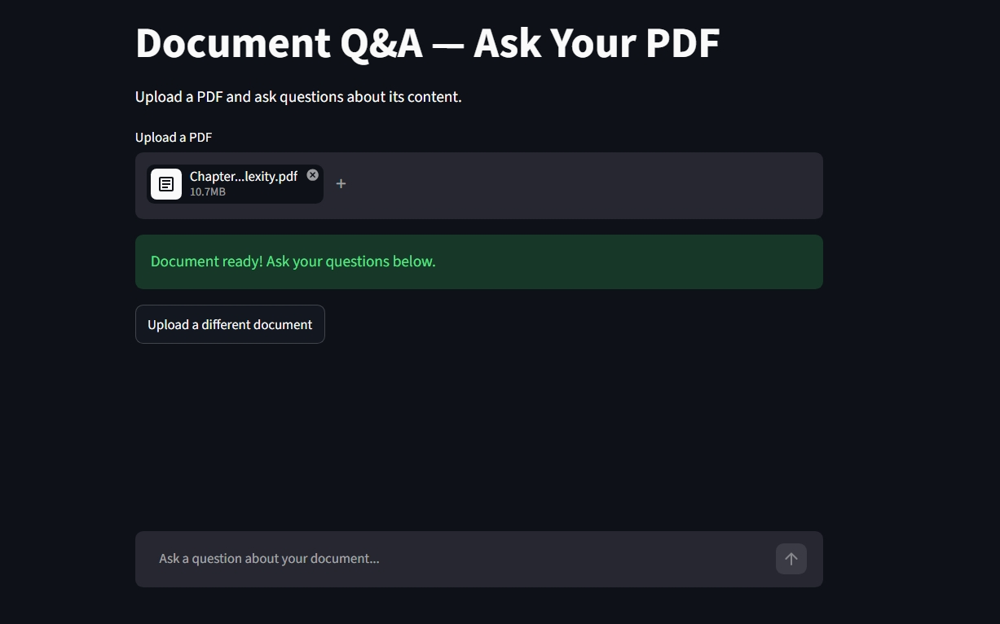
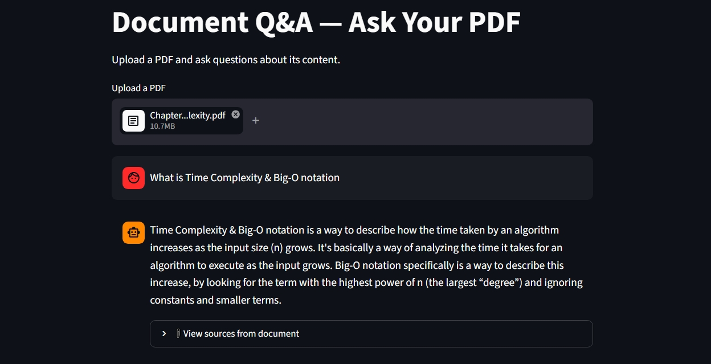
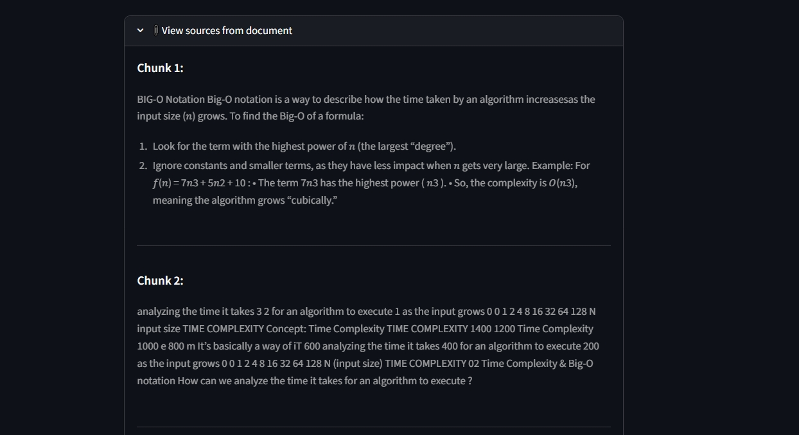

# Document Intelligence System
### RAG-Powered PDF Question Answering

An AI-powered document analysis system that enables natural language querying over PDF documents using Retrieval-Augmented Generation (RAG). Upload any PDF and ask questions — the system retrieves semantically relevant context and generates grounded, cited answers using a large language model.

🔗 **Live Demo:** https://doc-intel-rag-system.streamlit.app/
---

## Features

- **Semantic search** over PDF content using vector embeddings
- **Grounded answers** generated strictly from document context, not model memory
- **Source citations** — every answer links back to the exact chunks it was derived from
- **Persistent chat history** within a session for multi-turn conversations
- **Clean conversational UI** built with Streamlit

---

## System Architecture

```
PDF Upload
    │
    ▼
Text Extraction (pdfplumber)
    │
    ▼
Chunking (LangChain RecursiveCharacterTextSplitter)
    │
    ▼
Embedding (HuggingFace all-MiniLM-L6-v2)
    │
    ▼
Vector Store (FAISS)
    │
    ▼
User Question ──► Similarity Search (top-k chunks)
                        │
                        ▼
              Context + Question ──► LLM (LLaMA 3 via Groq API)
                        │
                        ▼
                  Grounded Answer + Sources
```

---

## How It Works

1. **Upload** — User uploads a PDF through the Streamlit interface
2. **Parse** — Raw text is extracted page by page using `pdfplumber`
3. **Chunk** — Text is split into overlapping 1000-character chunks to preserve context
4. **Embed** — Each chunk is converted into a vector using HuggingFace sentence embeddings
5. **Store** — Vectors are indexed in a local FAISS vector store
6. **Query** — On each question, the top-4 most semantically similar chunks are retrieved
7. **Answer** — Retrieved chunks + question are passed to LLaMA 3 (Groq API) for a grounded response

---

## Tech Stack

| Layer | Technology |
|---|---|
| Language | Python 3.11 |
| RAG Framework | LangChain |
| Embeddings | HuggingFace `all-MiniLM-L6-v2` |
| Vector Store | FAISS |
| LLM | LLaMA 3 (via Groq API) |
| PDF Parsing | pdfplumber |
| UI | Streamlit |

---

## Getting Started

### Prerequisites
- Python 3.9+
- A free [Groq API key](https://console.groq.com)

### Installation

```bash
# Clone the repository
git clone https://github.com/lara-taan/document-intelligence-system.git
cd document-intelligence-system

# Create and activate virtual environment
python -m venv venv
venv\Scripts\activate        # Windows
source venv/bin/activate     # Mac/Linux

# Install dependencies
pip install -r requirements.txt
```

### Configuration

Create a `.env` file in the root directory:

```
GROQ_API_KEY=your_api_key_here
```

### Run

```bash
streamlit run app.py
```

---

## Project Structure

```
document-intelligence-system/
├── app.py               # Streamlit UI
├── rag_pipeline.py      # RAG logic (parsing, embedding, retrieval, generation)
├── .env                 # API keys (not committed)
├── requirements.txt     # Dependencies
└── README.md
```

---

## Screenshots

### PDF Upload & Indexing


### Chat Interface


### Source Citations


---

## Roadmap

- [ ] Multi-document support
- [ ] Streaming responses
- [ ] Document history across sessions
- [ ] Support for DOCX and TXT files

---


